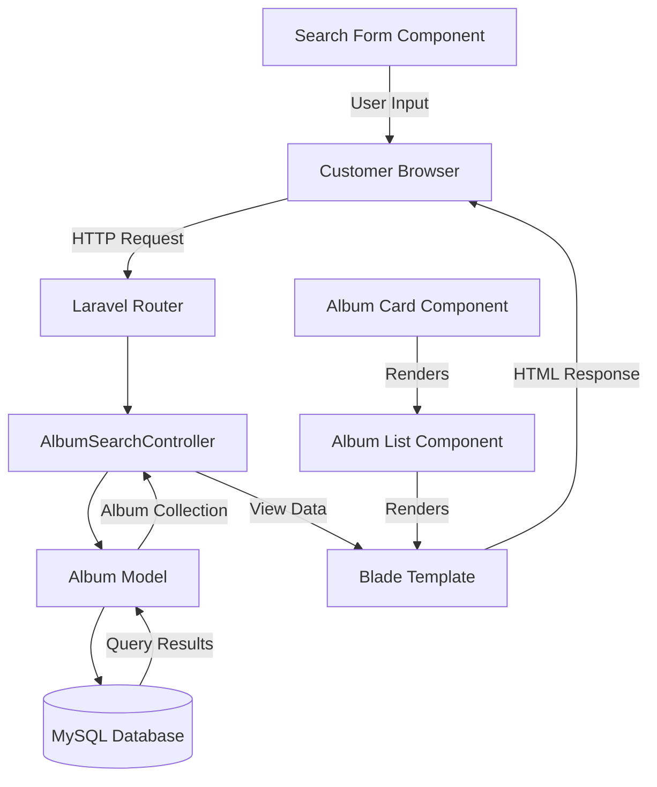
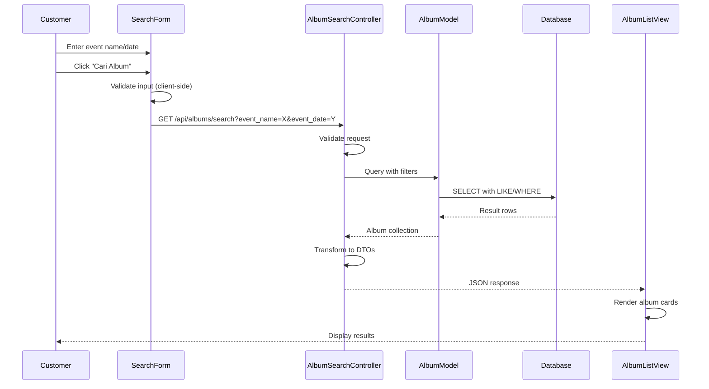
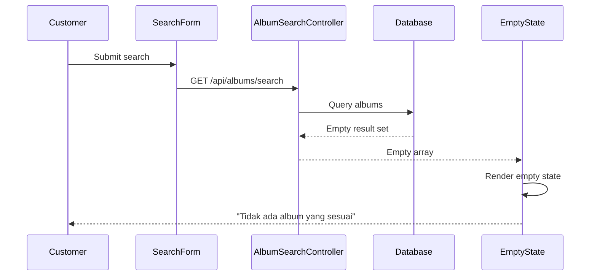

# Design Document: Customer Dashboard Search & Albums

## Overview

The **Customer Dashboard Search & Albums** feature provides a simplified search interface for customers to find event albums using only event name and date fields. The system displays matching albums in a responsive grid layout with metadata (title, date, location, photographer, photo count). This feature focuses exclusively on the search form UI, album search API, and album listing view, without implementing face matching or photo filtering (covered in separate specs). The design uses Laravel/PHP backend with Blade templates for the frontend, following the existing codebase patterns.

## Architecture



## Sequence Diagrams

### Main Search Flow



### Empty Results Flow



## Components and Interfaces

### Component 1: SearchForm

**Purpose**: Provides user interface for entering search criteria (event name and date)

**Interface**:
```php
interface SearchFormInterface
{
    public function render(): string;
    public function validate(array $input): array;
    public function getEventName(): ?string;
    public function getEventDate(): ?string;
}
```

**Responsibilities**:
- Display event name input field with Indonesian label
- Display date picker for event date selection
- Validate that at least one field is filled
- Submit search request to backend API
- Display validation errors to user

### Component 2: AlbumSearchController

**Purpose**: Handles album search API requests and returns filtered results

**Interface**:
```php
namespace App\Http\Controllers;

use Illuminate\Http\Request;
use Illuminate\Http\JsonResponse;

class AlbumSearchController extends Controller
{
    /**
     * Search albums by event name and/or date
     *
     * @param Request $request
     * @return JsonResponse
     */
    public function search(Request $request): JsonResponse;
    
    /**
     * Validate search request parameters
     *
     * @param Request $request
     * @return array
     * @throws ValidationException
     */
    private function validateSearchRequest(Request $request): array;
    
    /**
     * Build query with filters
     *
     * @param string|null $eventName
     * @param string|null $eventDate
     * @return \Illuminate\Database\Eloquent\Builder
     */
    private function buildSearchQuery(?string $eventName, ?string $eventDate);
    
    /**
     * Transform albums to DTOs
     *
     * @param \Illuminate\Database\Eloquent\Collection $albums
     * @return array
     */
    private function transformToDto($albums): array;
}
```

**Responsibilities**:
- Validate search request parameters
- Build database query with LIKE and WHERE clauses
- Execute query and retrieve matching albums
- Transform results to JSON DTOs
- Return JSON response with album data

### Component 3: AlbumList

**Purpose**: Displays grid of album cards with responsive layout

**Interface**:
```php
interface AlbumListInterface
{
    public function render(array $albums): string;
    public function renderEmpty(): string;
    public function getGridColumns(): int;
}
```

**Responsibilities**:
- Render album cards in responsive grid (3-4 columns desktop, 2 tablet, 1 mobile)
- Display loading indicator during search
- Display empty state when no results
- Handle album card click events

### Component 4: AlbumCard

**Purpose**: Displays individual album metadata in card format

**Interface**:
```php
interface AlbumCardInterface
{
    public function render(array $albumData): string;
    public function getThumbnailUrl(): string;
    public function getTitle(): string;
    public function getEventDate(): string;
    public function getLocation(): string;
    public function getPhotographerName(): string;
    public function getPhotoCount(): int;
}
```

**Responsibilities**:
- Display album thumbnail image
- Display album title
- Display event date (formatted: "DD MMM YYYY")
- Display location
- Display photographer name
- Display photo count badge
- Provide click handler to view album details

## Data Models

### Model 1: Album

```php
namespace App\Models;

use Illuminate\Database\Eloquent\Model;
use Illuminate\Database\Eloquent\Relations\BelongsTo;
use Illuminate\Database\Eloquent\Relations\HasMany;

class Album extends Model
{
    protected $fillable = [
        'photographer_id',
        'title',
        'location',
        'event_date'
    ];
    
    protected $casts = [
        'event_date' => 'datetime'
    ];
    
    public function photographer(): BelongsTo;
    public function photos(): HasMany;
    public function getPhotoCount(): int;
}
```

**Validation Rules**:
- `title`: required, string, max 255 characters
- `location`: nullable, string, max 255 characters
- `event_date`: nullable, datetime
- `photographer_id`: required, exists in users table

### Model 2: AlbumSearchDTO

```php
namespace App\DTOs;

class AlbumSearchDTO
{
    public int $id;
    public string $title;
    public ?string $location;
    public ?string $event_date; // ISO 8601 format
    public string $photographer_name;
    public int $photo_count;
    public ?string $thumbnail_url;
    
    public function __construct(array $data);
    public function toArray(): array;
}
```

**Validation Rules**:
- `id`: positive integer
- `title`: non-empty string
- `event_date`: ISO 8601 date string or null
- `photo_count`: non-negative integer

## Algorithmic Pseudocode

### Main Search Algorithm

```php
/**
 * Search albums by event name and/or date
 *
 * Preconditions:
 * - Request is authenticated
 * - At least one search parameter (event_name or event_date) is provided
 * - event_date is in valid YYYY-MM-DD format if provided
 *
 * Postconditions:
 * - Returns JSON array of matching albums
 * - Albums are ordered by event_date DESC
 * - Each album includes photographer name and photo count
 * - Returns empty array if no matches found
 */
public function search(Request $request): JsonResponse
{
    // Step 1: Validate request parameters
    $validated = $this->validateSearchRequest($request);
    $eventName = $validated['event_name'] ?? null;
    $eventDate = $validated['event_date'] ?? null;
    
    // Step 2: Build query with filters
    $query = $this->buildSearchQuery($eventName, $eventDate);
    
    // Step 3: Execute query with eager loading
    $albums = $query->with(['photographer', 'photos'])
                    ->orderBy('event_date', 'desc')
                    ->get();
    
    // Step 4: Transform to DTOs
    $albumDtos = $this->transformToDto($albums);
    
    // Step 5: Return JSON response
    return response()->json([
        'success' => true,
        'data' => $albumDtos,
        'count' => count($albumDtos)
    ]);
}
```

**Preconditions:**
- Request is authenticated (customer is logged in)
- At least one search parameter is provided
- event_date is in valid YYYY-MM-DD format if provided

**Postconditions:**
- Returns JSON response with success flag
- Albums array is sorted by event_date DESC
- Each album includes all required metadata
- Empty array returned if no matches

**Loop Invariants:** N/A (no explicit loops in main algorithm)

### Query Builder Algorithm

```php
/**
 * Build search query with filters
 *
 * Preconditions:
 * - At least one of $eventName or $eventDate is non-null
 * - $eventDate is in YYYY-MM-DD format if provided
 *
 * Postconditions:
 * - Returns Eloquent query builder with appropriate WHERE clauses
 * - Query uses LIKE for event name (case-insensitive partial match)
 * - Query uses exact match for event date
 * - Multiple filters are combined with AND logic
 */
private function buildSearchQuery(?string $eventName, ?string $eventDate)
{
    $query = Album::query();
    
    // Apply event name filter (case-insensitive partial match)
    if ($eventName !== null) {
        $query->where('title', 'LIKE', '%' . $eventName . '%');
    }
    
    // Apply event date filter (exact match on date part)
    if ($eventDate !== null) {
        $query->whereDate('event_date', '=', $eventDate);
    }
    
    return $query;
}
```

**Preconditions:**
- At least one parameter is non-null
- $eventDate is valid date string if provided

**Postconditions:**
- Returns query builder with filters applied
- Filters use appropriate SQL operators (LIKE, =)
- Multiple filters combined with AND

**Loop Invariants:** N/A

### Validation Algorithm

```php
/**
 * Validate search request parameters
 *
 * Preconditions:
 * - Request object is provided
 *
 * Postconditions:
 * - Returns validated data array if validation passes
 * - Throws ValidationException if validation fails
 * - At least one field (event_name or event_date) is present
 * - event_date is in YYYY-MM-DD format if provided
 * - event_name is max 255 characters if provided
 */
private function validateSearchRequest(Request $request): array
{
    $rules = [
        'event_name' => 'nullable|string|max:255',
        'event_date' => 'nullable|date_format:Y-m-d'
    ];
    
    $validated = $request->validate($rules);
    
    // Ensure at least one field is filled
    if (empty($validated['event_name']) && empty($validated['event_date'])) {
        throw ValidationException::withMessages([
            'search' => 'Mohon isi minimal satu field pencarian'
        ]);
    }
    
    return $validated;
}
```

**Preconditions:**
- Request object exists

**Postconditions:**
- Returns array with validated data
- Throws exception if validation fails
- At least one search field is present

**Loop Invariants:** N/A

### DTO Transformation Algorithm

```php
/**
 * Transform album models to DTOs
 *
 * Preconditions:
 * - $albums is a valid Eloquent collection
 * - Each album has photographer relationship loaded
 * - Each album has photos relationship loaded
 *
 * Postconditions:
 * - Returns array of AlbumSearchDTO objects
 * - Each DTO contains all required fields
 * - photo_count is accurate count of photos in album
 * - photographer_name is retrieved from relationship
 */
private function transformToDto($albums): array
{
    $dtos = [];
    
    foreach ($albums as $album) {
        $dtos[] = [
            'id' => $album->id,
            'title' => $album->title,
            'location' => $album->location,
            'event_date' => $album->event_date?->format('Y-m-d'),
            'photographer_name' => $album->photographer->name,
            'photo_count' => $album->photos->count(),
            'thumbnail_url' => $this->getThumbnailUrl($album)
        ];
    }
    
    return $dtos;
}
```

**Preconditions:**
- Albums collection is valid
- Relationships are eager loaded

**Postconditions:**
- Returns array of DTO arrays
- All required fields are present
- Counts are accurate

**Loop Invariants:**
- All previously processed albums have valid DTOs in $dtos array
- Each iteration adds exactly one DTO to the array

## Key Functions with Formal Specifications

### Function 1: search()

```php
public function search(Request $request): JsonResponse
```

**Preconditions:**
- Request is authenticated (middleware ensures user is logged in)
- Request contains at least one of: event_name or event_date
- event_date is in YYYY-MM-DD format if provided
- event_name is max 255 characters if provided

**Postconditions:**
- Returns JsonResponse with status 200
- Response contains 'success' boolean field
- Response contains 'data' array field with album DTOs
- Response contains 'count' integer field
- Albums in 'data' are sorted by event_date DESC
- If no matches: 'data' is empty array, 'count' is 0
- If validation fails: throws ValidationException (handled by Laravel)

**Loop Invariants:** N/A

### Function 2: buildSearchQuery()

```php
private function buildSearchQuery(?string $eventName, ?string $eventDate)
```

**Preconditions:**
- At least one of $eventName or $eventDate is non-null
- $eventDate is in YYYY-MM-DD format if provided
- $eventName is sanitized string if provided

**Postconditions:**
- Returns Eloquent Builder instance
- Builder has WHERE clause for event_name if $eventName provided (LIKE operator)
- Builder has WHERE clause for event_date if $eventDate provided (exact match)
- Multiple filters are combined with AND logic
- No side effects on database (query not executed)

**Loop Invariants:** N/A

### Function 3: validateSearchRequest()

```php
private function validateSearchRequest(Request $request): array
```

**Preconditions:**
- $request is valid Request object

**Postconditions:**
- Returns array with validated data if validation passes
- Throws ValidationException if validation fails
- Returned array contains only 'event_name' and/or 'event_date' keys
- At least one key is present in returned array
- event_date value matches YYYY-MM-DD format if present
- event_name value is max 255 characters if present

**Loop Invariants:** N/A

### Function 4: transformToDto()

```php
private function transformToDto($albums): array
```

**Preconditions:**
- $albums is Eloquent Collection
- Each album has 'photographer' relationship loaded
- Each album has 'photos' relationship loaded
- Each album has valid id, title, location, event_date fields

**Postconditions:**
- Returns array of associative arrays (DTOs)
- Array length equals $albums->count()
- Each DTO has keys: id, title, location, event_date, photographer_name, photo_count, thumbnail_url
- photo_count equals actual count of photos in album
- photographer_name is retrieved from relationship
- No mutations to input $albums collection

**Loop Invariants:**
- For each iteration i: $dtos contains exactly i valid DTOs
- For each iteration i: all DTOs in $dtos[0..i-1] have all required fields
- For each iteration i: $dtos[i-1] corresponds to $albums[i-1]

## Example Usage

### Example 1: Search by Event Name Only

```php
// Customer submits search form with event name
GET /api/albums/search?event_name=CFD

// Controller processes request
$request = Request::create('/api/albums/search', 'GET', [
    'event_name' => 'CFD'
]);

$controller = new AlbumSearchController();
$response = $controller->search($request);

// Response JSON
{
    "success": true,
    "data": [
        {
            "id": 1,
            "title": "CFD Simpang Lima",
            "location": "Semarang",
            "event_date": "2024-01-15",
            "photographer_name": "John Doe",
            "photo_count": 150,
            "thumbnail_url": "/storage/albums/1/thumb.jpg"
        },
        {
            "id": 3,
            "title": "CFD Taman Kota",
            "location": "Jakarta",
            "event_date": "2024-01-10",
            "photographer_name": "Jane Smith",
            "photo_count": 200,
            "thumbnail_url": "/storage/albums/3/thumb.jpg"
        }
    ],
    "count": 2
}
```

### Example 2: Search by Event Date Only

```php
// Customer submits search form with date
GET /api/albums/search?event_date=2024-01-15

// Controller processes request
$request = Request::create('/api/albums/search', 'GET', [
    'event_date' => '2024-01-15'
]);

$controller = new AlbumSearchController();
$response = $controller->search($request);

// Response JSON
{
    "success": true,
    "data": [
        {
            "id": 1,
            "title": "CFD Simpang Lima",
            "location": "Semarang",
            "event_date": "2024-01-15",
            "photographer_name": "John Doe",
            "photo_count": 150,
            "thumbnail_url": "/storage/albums/1/thumb.jpg"
        }
    ],
    "count": 1
}
```

### Example 3: Search with Both Parameters

```php
// Customer submits search form with both fields
GET /api/albums/search?event_name=CFD&event_date=2024-01-15

// Controller processes request
$request = Request::create('/api/albums/search', 'GET', [
    'event_name' => 'CFD',
    'event_date' => '2024-01-15'
]);

$controller = new AlbumSearchController();
$response = $controller->search($request);

// Response JSON (only albums matching BOTH criteria)
{
    "success": true,
    "data": [
        {
            "id": 1,
            "title": "CFD Simpang Lima",
            "location": "Semarang",
            "event_date": "2024-01-15",
            "photographer_name": "John Doe",
            "photo_count": 150,
            "thumbnail_url": "/storage/albums/1/thumb.jpg"
        }
    ],
    "count": 1
}
```

### Example 4: No Results Found

```php
// Customer searches for non-existent event
GET /api/albums/search?event_name=NonExistentEvent

$response = $controller->search($request);

// Response JSON
{
    "success": true,
    "data": [],
    "count": 0
}

// Frontend displays: "Tidak ada album yang sesuai dengan pencarian Anda"
```

### Example 5: Validation Error

```php
// Customer submits empty search form
GET /api/albums/search

// Validation fails, throws ValidationException
// Laravel returns 422 response:
{
    "message": "Mohon isi minimal satu field pencarian",
    "errors": {
        "search": ["Mohon isi minimal satu field pencarian"]
    }
}
```

## Correctness Properties

### Property 1: Search Result Consistency
**Universal Quantification:** ∀ albums A, search parameters P: If album A matches parameters P, then A ∈ search_results(P)

**Verification:** Unit tests verify that albums matching search criteria are included in results

### Property 2: Filter Logic Correctness
**Universal Quantification:** ∀ albums A, event_name N: If A.title contains N (case-insensitive), then A ∈ search_results(event_name=N)

**Verification:** Integration tests verify LIKE query behavior

### Property 3: Date Matching Exactness
**Universal Quantification:** ∀ albums A, date D: A ∈ search_results(event_date=D) ⟺ A.event_date.date = D

**Verification:** Unit tests verify exact date matching

### Property 4: AND Logic for Multiple Filters
**Universal Quantification:** ∀ albums A, name N, date D: A ∈ search_results(event_name=N, event_date=D) ⟺ (A.title contains N) ∧ (A.event_date.date = D)

**Verification:** Integration tests verify combined filter behavior

### Property 5: Result Ordering
**Universal Quantification:** ∀ results R: ∀ i, j where i < j: R[i].event_date ≥ R[j].event_date

**Verification:** Unit tests verify descending date order

### Property 6: DTO Completeness
**Universal Quantification:** ∀ albums A in results: DTO(A) contains all required fields (id, title, location, event_date, photographer_name, photo_count, thumbnail_url)

**Verification:** Unit tests verify DTO structure

### Property 7: Photo Count Accuracy
**Universal Quantification:** ∀ albums A: DTO(A).photo_count = |A.photos|

**Verification:** Integration tests verify count accuracy

### Property 8: Empty Result Handling
**Universal Quantification:** If no albums match search criteria, then search_results = [] ∧ count = 0

**Verification:** Unit tests verify empty result behavior

## Error Handling

### Error Scenario 1: Empty Search Form

**Condition:** Customer submits search form without filling any fields
**Response:** Return 422 Unprocessable Entity with validation error message
**Recovery:** Display error message "Mohon isi minimal satu field pencarian" below search form

### Error Scenario 2: Invalid Date Format

**Condition:** Customer enters date in invalid format (e.g., "15-01-2024" instead of "2024-01-15")
**Response:** Return 422 Unprocessable Entity with validation error
**Recovery:** Display error message "Format tanggal harus YYYY-MM-DD" below date field

### Error Scenario 3: Database Connection Error

**Condition:** Database is unavailable or connection fails during query
**Response:** Return 500 Internal Server Error
**Recovery:** Display error message "Terjadi kesalahan server. Silakan coba lagi" and log error details

### Error Scenario 4: Missing Photographer Relationship

**Condition:** Album has invalid photographer_id (orphaned record)
**Response:** Skip album in results or use placeholder name
**Recovery:** Log warning and continue processing other albums

### Error Scenario 5: Event Name Too Long

**Condition:** Customer enters event name exceeding 255 characters
**Response:** Return 422 Unprocessable Entity with validation error
**Recovery:** Display error message "Nama acara maksimal 255 karakter"

## Testing Strategy

### Unit Testing Approach

**Test Coverage:**
- AlbumSearchController::validateSearchRequest() with valid/invalid inputs
- AlbumSearchController::buildSearchQuery() with various parameter combinations
- AlbumSearchController::transformToDto() with sample album collections
- Validation rules for event_name and event_date
- DTO structure and field presence

**Key Test Cases:**
1. Validate search request with only event_name
2. Validate search request with only event_date
3. Validate search request with both parameters
4. Reject empty search request
5. Reject invalid date format
6. Reject event_name exceeding 255 characters
7. Build query with event_name filter
8. Build query with event_date filter
9. Build query with both filters
10. Transform empty album collection to empty array
11. Transform single album to DTO with all fields
12. Transform multiple albums to DTO array

**Coverage Goal:** Minimum 90% code coverage for AlbumSearchController

### Property-Based Testing Approach

**Property Test Library:** PHPUnit with Eris (PHP property-based testing library)

**Properties to Test:**

1. **Search Idempotence:** Searching with same parameters twice returns identical results
2. **Filter Subset Property:** Results with both filters ⊆ results with single filter
3. **Date Ordering Property:** All results are ordered by event_date DESC
4. **DTO Completeness Property:** All DTOs have required fields
5. **Photo Count Non-Negative:** All photo_count values ≥ 0

**Example Property Test:**
```php
use Eris\Generator;

public function testSearchResultsAreOrderedByDateDescending()
{
    $this->forAll(
        Generator::string(),
        Generator::date()
    )->then(function ($eventName, $eventDate) {
        $results = $this->controller->search(
            Request::create('/api/albums/search', 'GET', [
                'event_name' => $eventName
            ])
        )->getData()->data;
        
        // Verify ordering property
        for ($i = 0; $i < count($results) - 1; $i++) {
            $this->assertGreaterThanOrEqual(
                $results[$i + 1]->event_date,
                $results[$i]->event_date
            );
        }
    });
}
```

### Integration Testing Approach

**Test Coverage:**
- Complete search flow from HTTP request to JSON response
- Database query execution with real database
- Eager loading of relationships (photographer, photos)
- Response structure and status codes
- Error handling for various failure scenarios

**Key Integration Tests:**
1. Search by event name returns matching albums
2. Search by event date returns albums on that date
3. Search with both parameters returns albums matching both
4. Search with no matches returns empty array
5. Empty search request returns 422 validation error
6. Invalid date format returns 422 validation error
7. Results include photographer name from relationship
8. Results include accurate photo count
9. Results are ordered by event_date DESC
10. Response includes success flag and count field

**Test Database:** Use SQLite in-memory database for fast integration tests

## Performance Considerations

### Database Indexing

**Required Indexes:**
1. Index on `albums.title` for faster LIKE queries
2. Index on `albums.event_date` for faster date filtering
3. Composite index on `(title, event_date)` for combined searches

**Index Creation:**
```php
// Migration
Schema::table('albums', function (Blueprint $table) {
    $table->index('title');
    $table->index('event_date');
    $table->index(['title', 'event_date']);
});
```

### Query Optimization

**Eager Loading:** Use `with(['photographer', 'photos'])` to avoid N+1 query problem

**Pagination:** Implement pagination for large result sets (25 albums per page)

**Caching:** Cache album metadata for frequently searched events (Redis cache, 5-minute TTL)

### Response Time Targets

- Search query execution: < 100ms for up to 1000 albums
- DTO transformation: < 50ms for up to 100 albums
- Total API response time: < 200ms (95th percentile)

### Scalability Considerations

- Use database read replicas for search queries
- Implement API rate limiting (20 requests per minute per user)
- Use CDN for album thumbnail images
- Implement lazy loading for album thumbnails in frontend

## Security Considerations

### Authentication and Authorization

**Authentication:** Require customer authentication via Laravel Sanctum or session-based auth

**Authorization:** Customers can only search public albums (no photographer-specific restrictions for search)

### Input Validation and Sanitization

**SQL Injection Prevention:** Use Laravel query builder with parameter binding (automatic)

**XSS Prevention:** Escape all output in Blade templates (automatic with `{{ }}` syntax)

**Input Sanitization:** Validate and sanitize event_name to prevent malicious input

### Rate Limiting

**Implementation:** Use Laravel rate limiting middleware

**Limits:**
- 20 search requests per minute per authenticated user
- 5 search requests per minute per IP for unauthenticated users

**Response:** Return 429 Too Many Requests when limit exceeded

### Data Privacy

**No Sensitive Data Exposure:** Search API does not expose customer face embeddings or personal data

**HTTPS Only:** Enforce HTTPS for all API requests (middleware)

**Logging:** Log search queries without exposing sensitive customer information

## Dependencies

### Backend Dependencies

1. **Laravel Framework** (v10.x): Core PHP framework
2. **Laravel Eloquent ORM**: Database query builder and model relationships
3. **Laravel Validation**: Request validation
4. **MySQL** (v8.0+): Database for storing albums
5. **PHPUnit** (v10.x): Unit testing framework
6. **Eris** (v0.13+): Property-based testing library for PHP

### Frontend Dependencies

1. **Blade Templates**: Laravel templating engine
2. **Tailwind CSS** (v3.x): Utility-first CSS framework for responsive design
3. **Alpine.js** (v3.x): Lightweight JavaScript framework for interactivity
4. **Axios** (v1.x): HTTP client for API requests

### Development Dependencies

1. **Laravel Debugbar**: Development debugging tool
2. **PHPStan** (v1.x): Static analysis tool
3. **PHP CS Fixer**: Code style fixer

### Infrastructure Dependencies

1. **Redis** (v7.x): Caching layer for album metadata
2. **Nginx** or **Apache**: Web server
3. **PHP** (v8.1+): Runtime environment
