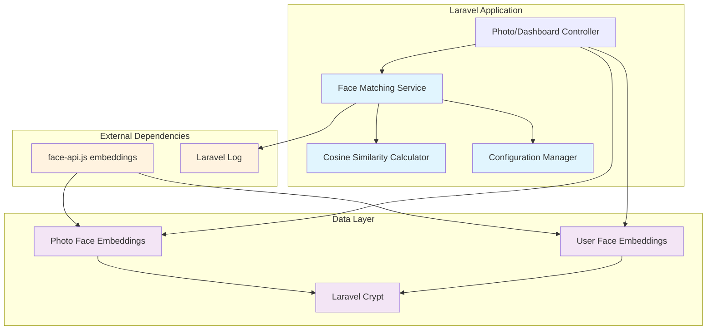

# Design Document: Face Matching Service

## Overview

The Face Matching Service provides the core mathematical engine for face recognition in the Fotlist photography platform. This service implements cosine similarity calculations for 128-dimensional face embedding vectors and provides efficient batch processing capabilities for matching customer faces against multiple photos in albums. The service is designed as a pure mathematical service with no UI components or direct database access, focusing exclusively on algorithmic correctness and performance optimization.

The service integrates with the existing Laravel application architecture and works with encrypted face embeddings stored during customer registration. It provides a stateless, thread-safe interface that can process up to 1000 photos in under 10 seconds while maintaining mathematical accuracy and handling edge cases gracefully.

## Architecture

### System Integration



### Service Layer Architecture

The Face Matching Service follows a layered architecture with clear separation of concerns:

1. **Service Layer** (`FaceMatchingService`): Orchestrates batch processing, handles multiple faces per photo, manages thresholds
2. **Calculator Layer** (`CosineSimilarityCalculator`): Pure mathematical functions for cosine similarity computation
3. **Configuration Layer**: Manages threshold settings and performance parameters
4. **Validation Layer**: Input validation and type safety checks

## Components and Interfaces

### Core Service Interface

```php
<?php

namespace App\Services\FaceMatching;

/**
 * Face Matching Service for comparing customer embeddings with photo embeddings
 * 
 * This service provides batch processing capabilities for matching a customer's
 * face embedding against multiple photo embeddings using cosine similarity.
 */
class FaceMatchingService
{
    private CosineSimilarityCalculator $calculator;
    private float $defaultThreshold;
    
    public function __construct(
        CosineSimilarityCalculator $calculator,
        float $defaultThreshold = 0.6
    ) {
        $this->calculator = $calculator;
        $this->setDefaultThreshold($defaultThreshold);
    }
    
    /**
     * Match customer embedding against multiple photo embeddings
     * 
     * @param array $customerEmbedding 128-dimensional float array
     * @param array $photoEmbeddings Array of PhotoEmbeddingData objects
     * @param float|null $threshold Override default threshold (0.0-1.0)
     * @return MatchResult[] Sorted by similarity score (descending)
     * @throws InvalidArgumentException For invalid inputs
     */
    public function matchFaces(
        array $customerEmbedding,
        array $photoEmbeddings,
        ?float $threshold = null
    ): array;
    
    /**
     * Set default similarity threshold
     * 
     * @param float $threshold Value between 0.0 and 1.0
     * @throws InvalidArgumentException If threshold out of range
     */
    public function setDefaultThreshold(float $threshold): void;
    
    /**
     * Get current default threshold
     */
    public function getDefaultThreshold(): float;
}
```

### Cosine Similarity Calculator Interface

```php
<?php

namespace App\Services\FaceMatching;

/**
 * Pure mathematical calculator for cosine similarity between embedding vectors
 */
class CosineSimilarityCalculator
{
    /**
     * Calculate cosine similarity between two embedding vectors
     * 
     * Formula: similarity = dot_product(A, B) / (magnitude(A) * magnitude(B))
     * 
     * @param array $embeddingA 128-dimensional float array
     * @param array $embeddingB 128-dimensional float array
     * @return float Similarity score in range [-1, 1]
     * @throws InvalidArgumentException For dimension mismatch or invalid inputs
     */
    public function calculateSimilarity(array $embeddingA, array $embeddingB): float;
    
    /**
     * Calculate dot product of two vectors
     * 
     * @param array $vectorA Numeric array
     * @param array $vectorB Numeric array (same length as A)
     * @return float Sum of element-wise multiplication
     */
    public function dotProduct(array $vectorA, array $vectorB): float;
    
    /**
     * Calculate L2 norm (Euclidean magnitude) of a vector
     * 
     * @param array $vector Numeric array
     * @return float Square root of sum of squared elements
     */
    public function magnitude(array $vector): float;
    
    /**
     * Validate that embedding has exactly 128 dimensions and all numeric values
     * 
     * @param array $embedding Embedding to validate
     * @param string $context Context for error messages (e.g., "customer", "photo")
     * @throws InvalidArgumentException For invalid embeddings
     */
    public function validateEmbedding(array $embedding, string $context): void;
}
```

### Data Transfer Objects

```php
<?php

namespace App\Services\FaceMatching\DTOs;

/**
 * Input data for photo embeddings with metadata
 */
class PhotoEmbeddingData
{
    public function __construct(
        public readonly int|string $photoId,
        public readonly array $embeddings  // Array of 128-dim arrays (multiple faces)
    ) {}
}

/**
 * Result of face matching operation
 */
class MatchResult
{
    public function __construct(
        public readonly int|string $photoId,
        public readonly float $similarityScore,
        public readonly bool $matchesThreshold
    ) {}
    
    /**
     * Create from similarity score and threshold
     */
    public static function create(
        int|string $photoId,
        float $similarityScore,
        float $threshold
    ): self {
        return new self(
            $photoId,
            $similarityScore,
            $similarityScore >= $threshold
        );
    }
}
```

### Configuration Interface

```php
<?php

namespace App\Services\FaceMatching;

/**
 * Configuration manager for face matching parameters
 */
class FaceMatchingConfig
{
    public const DEFAULT_THRESHOLD = 0.6;
    public const EMBEDDING_DIMENSIONS = 128;
    public const MAX_PROCESSING_TIME_SECONDS = 10;
    public const CHUNK_SIZE_LARGE_ALBUMS = 500;
    public const LARGE_ALBUM_THRESHOLD = 5000;
    
    /**
     * Get similarity threshold from config with fallback to default
     */
    public static function getSimilarityThreshold(): float;
    
    /**
     * Validate threshold value is in valid range
     */
    public static function validateThreshold(float $threshold): void;
    
    /**
     * Get chunk size for batch processing based on album size
     */
    public static function getChunkSize(int $photoCount): int;
}
```

## Data Models

### Face Embedding Structure

Face embeddings are 128-dimensional float arrays generated by face-api.js:

```php
// Example embedding structure
$embedding = [
    0.123456,   // Dimension 0
    -0.789012,  // Dimension 1
    0.345678,   // Dimension 2
    // ... 125 more dimensions
    0.901234    // Dimension 127
];

// Validation constraints:
// - Exactly 128 elements
// - All elements are numeric (int or float)
// - Values typically in range [-1, 1] but not strictly enforced
// - No NaN or Infinity values allowed
```

### Photo Embedding Collection

Photos may contain multiple faces, so each photo has an array of embeddings:

```php
$photoEmbeddings = [
    new PhotoEmbeddingData(
        photoId: 1001,
        embeddings: [
            [0.123, -0.456, 0.789, /* ... 125 more */],  // Face 1
            [0.987, -0.654, 0.321, /* ... 125 more */]   // Face 2
        ]
    ),
    new PhotoEmbeddingData(
        photoId: 1002,
        embeddings: [
            [0.555, -0.333, 0.777, /* ... 125 more */]   // Single face
        ]
    )
];
```

### Match Result Collection

Results are returned as sorted arrays of MatchResult objects:

```php
$results = [
    new MatchResult(
        photoId: 1001,
        similarityScore: 0.87,
        matchesThreshold: true
    ),
    new MatchResult(
        photoId: 1003,
        similarityScore: 0.72,
        matchesThreshold: true
    ),
    new MatchResult(
        photoId: 1002,
        similarityScore: 0.45,
        matchesThreshold: false  // Below threshold
    )
];
```

## Mathematical Implementation

### Cosine Similarity Algorithm

The core algorithm implements the mathematical formula for cosine similarity:

```
similarity(A, B) = dot_product(A, B) / (magnitude(A) × magnitude(B))

where:
- dot_product(A, B) = Σ(A[i] × B[i]) for i = 0 to 127
- magnitude(A) = √(Σ(A[i]²)) for i = 0 to 127
```

### Detailed Implementation Pseudocode

```pascal
ALGORITHM calculateCosineSimilarity(embeddingA, embeddingB)
INPUT: embeddingA, embeddingB (128-dimensional float arrays)
OUTPUT: similarity score in range [-1, 1]

BEGIN
    // Input validation
    ASSERT length(embeddingA) = 128
    ASSERT length(embeddingB) = 128
    ASSERT allElementsNumeric(embeddingA) = true
    ASSERT allElementsNumeric(embeddingB) = true
    
    // Calculate dot product
    dotProduct ← 0.0
    FOR i ← 0 TO 127 DO
        dotProduct ← dotProduct + (embeddingA[i] × embeddingB[i])
    END FOR
    
    // Calculate magnitudes
    magnitudeA ← 0.0
    FOR i ← 0 TO 127 DO
        magnitudeA ← magnitudeA + (embeddingA[i] × embeddingA[i])
    END FOR
    magnitudeA ← sqrt(magnitudeA)
    
    magnitudeB ← 0.0
    FOR i ← 0 TO 127 DO
        magnitudeB ← magnitudeB + (embeddingB[i] × embeddingB[i])
    END FOR
    magnitudeB ← sqrt(magnitudeB)
    
    // Handle zero magnitude edge case
    IF magnitudeA = 0.0 OR magnitudeB = 0.0 THEN
        logWarning("Zero magnitude vector detected")
        RETURN 0.0
    END IF
    
    // Calculate similarity
    similarity ← dotProduct / (magnitudeA × magnitudeB)
    
    // Ensure result is in valid range (handle floating point errors)
    similarity ← max(-1.0, min(1.0, similarity))
    
    RETURN similarity
END
```

### Batch Processing Algorithm

```pascal
ALGORITHM matchFacesBatch(customerEmbedding, photoEmbeddings, threshold)
INPUT: customerEmbedding (128-dim array), photoEmbeddings (array of PhotoEmbeddingData), threshold (float)
OUTPUT: array of MatchResult objects sorted by similarity

BEGIN
    // Input validation
    validateEmbedding(customerEmbedding, "customer")
    ASSERT photoEmbeddings IS NOT NULL
    ASSERT 0.0 ≤ threshold ≤ 1.0
    
    // Pre-compute customer embedding magnitude for efficiency
    customerMagnitude ← calculateMagnitude(customerEmbedding)
    
    results ← empty array
    
    // Process each photo
    FOR EACH photo IN photoEmbeddings DO
        ASSERT photo.photoId IS NOT NULL
        
        maxSimilarity ← -1.0
        
        // Handle multiple faces per photo
        FOR EACH embedding IN photo.embeddings DO
            validateEmbedding(embedding, "photo")
            
            similarity ← calculateCosineSimilarity(customerEmbedding, embedding)
            
            IF similarity > maxSimilarity THEN
                maxSimilarity ← similarity
            END IF
        END FOR
        
        // Create result for this photo
        matchResult ← MatchResult.create(photo.photoId, maxSimilarity, threshold)
        results.add(matchResult)
    END FOR
    
    // Sort by similarity score (descending)
    results.sortBy(similarity, DESCENDING)
    
    RETURN results
END
```

### Memory-Efficient Chunked Processing

For large albums (>5000 photos), implement chunked processing:

```pascal
ALGORITHM matchFacesChunked(customerEmbedding, photoEmbeddings, threshold)
INPUT: customerEmbedding, photoEmbeddings (large collection), threshold
OUTPUT: array of MatchResult objects

BEGIN
    chunkSize ← getChunkSize(length(photoEmbeddings))
    allResults ← empty array
    
    FOR chunkStart ← 0 TO length(photoEmbeddings) STEP chunkSize DO
        chunkEnd ← min(chunkStart + chunkSize, length(photoEmbeddings))
        chunk ← photoEmbeddings[chunkStart:chunkEnd]
        
        chunkResults ← matchFacesBatch(customerEmbedding, chunk, threshold)
        allResults.addAll(chunkResults)
        
        // Release memory for processed chunk
        chunk ← NULL
        chunkResults ← NULL
        
        // Optional: garbage collection hint
        IF chunkEnd MOD (chunkSize × 10) = 0 THEN
            triggerGarbageCollection()
        END IF
    END FOR
    
    // Final sort of all results
    allResults.sortBy(similarity, DESCENDING)
    
    RETURN allResults
END
```

## Performance Optimization

### Vectorized Operations Strategy

1. **Pre-compute Customer Magnitude**: Calculate once per batch, reuse for all photos
2. **Minimize Array Allocations**: Reuse temporary variables where possible
3. **Early Termination**: Skip remaining faces in photo if one already exceeds threshold significantly
4. **Batch Validation**: Validate all inputs upfront to avoid repeated checks

### Memory Management

```php
class OptimizedFaceMatchingService extends FaceMatchingService
{
    private const MEMORY_LIMIT_MB = 512;
    private const GC_TRIGGER_INTERVAL = 1000; // photos
    
    public function matchFaces(array $customerEmbedding, array $photoEmbeddings, ?float $threshold = null): array
    {
        $this->validateMemoryAvailable();
        
        $threshold = $threshold ?? $this->defaultThreshold;
        $this->validateThreshold($threshold);
        
        // Pre-compute customer magnitude once
        $customerMagnitude = $this->calculator->magnitude($customerEmbedding);
        
        $results = [];
        $processedCount = 0;
        
        foreach ($photoEmbeddings as $photoData) {
            $maxSimilarity = $this->processPhotoEmbeddings(
                $customerEmbedding,
                $customerMagnitude,
                $photoData
            );
            
            $results[] = MatchResult::create($photoData->photoId, $maxSimilarity, $threshold);
            
            // Periodic garbage collection for large batches
            if (++$processedCount % self::GC_TRIGGER_INTERVAL === 0) {
                gc_collect_cycles();
            }
        }
        
        // Sort results by similarity (descending)
        usort($results, fn($a, $b) => $b->similarityScore <=> $a->similarityScore);
        
        return $results;
    }
    
    private function processPhotoEmbeddings(
        array $customerEmbedding,
        float $customerMagnitude,
        PhotoEmbeddingData $photoData
    ): float {
        $maxSimilarity = -1.0;
        
        foreach ($photoData->embeddings as $photoEmbedding) {
            $similarity = $this->calculateOptimizedSimilarity(
                $customerEmbedding,
                $customerMagnitude,
                $photoEmbedding
            );
            
            $maxSimilarity = max($maxSimilarity, $similarity);
        }
        
        return $maxSimilarity;
    }
    
    private function calculateOptimizedSimilarity(
        array $customerEmbedding,
        float $customerMagnitude,
        array $photoEmbedding
    ): float {
        // Skip full validation since we validated inputs upfront
        $dotProduct = 0.0;
        $photoMagnitudeSquared = 0.0;
        
        // Single loop for both dot product and photo magnitude
        for ($i = 0; $i < 128; $i++) {
            $customerVal = $customerEmbedding[$i];
            $photoVal = $photoEmbedding[$i];
            
            $dotProduct += $customerVal * $photoVal;
            $photoMagnitudeSquared += $photoVal * $photoVal;
        }
        
        $photoMagnitude = sqrt($photoMagnitudeSquared);
        
        // Handle zero magnitude
        if ($customerMagnitude === 0.0 || $photoMagnitude === 0.0) {
            return 0.0;
        }
        
        return $dotProduct / ($customerMagnitude * $photoMagnitude);
    }
}
```

### Performance Benchmarks

Target performance metrics:
- **1000 photos**: < 10 seconds
- **5000 photos**: < 45 seconds (chunked processing)
- **Memory usage**: < 512MB for 10,000 photos
- **CPU utilization**: Efficient single-thread processing

## Configuration Management

### Threshold Configuration System

```php
<?php

namespace App\Services\FaceMatching;

class FaceMatchingConfig
{
    /**
     * Get similarity threshold from Laravel config
     */
    public static function getSimilarityThreshold(): float
    {
        return config('face_matching.similarity_threshold', self::DEFAULT_THRESHOLD);
    }
    
    /**
     * Update threshold with validation and logging
     */
    public static function updateSimilarityThreshold(float $newThreshold): void
    {
        $oldThreshold = self::getSimilarityThreshold();
        
        self::validateThreshold($newThreshold);
        
        config(['face_matching.similarity_threshold' => $newThreshold]);
        
        Log::info('Face matching threshold updated', [
            'old_threshold' => $oldThreshold,
            'new_threshold' => $newThreshold,
            'timestamp' => now()->toISOString()
        ]);
    }
    
    /**
     * Validate threshold is in valid range
     */
    public static function validateThreshold(float $threshold): void
    {
        if ($threshold < 0.0 || $threshold > 1.0) {
            throw new InvalidArgumentException(
                "Threshold must be between 0.0 and 1.0, got {$threshold}"
            );
        }
    }
}
```

### Configuration File Structure

```php
// config/face_matching.php
<?php

return [
    /*
    |--------------------------------------------------------------------------
    | Face Matching Configuration
    |--------------------------------------------------------------------------
    */
    
    'similarity_threshold' => env('FACE_MATCHING_THRESHOLD', 0.6),
    
    'performance' => [
        'max_processing_time_seconds' => 10,
        'chunk_size_large_albums' => 500,
        'large_album_threshold' => 5000,
        'memory_limit_mb' => 512,
        'gc_trigger_interval' => 1000,
    ],
    
    'validation' => [
        'embedding_dimensions' => 128,
        'allow_zero_magnitude' => true,
        'strict_numeric_validation' => true,
    ],
    
    'logging' => [
        'log_performance_warnings' => true,
        'log_zero_magnitude_warnings' => true,
        'log_threshold_changes' => true,
        'exclude_embedding_values' => true, // Privacy protection
    ],
];
```

## Error Handling

### Exception Hierarchy

```php
<?php

namespace App\Services\FaceMatching\Exceptions;

/**
 * Base exception for face matching service errors
 */
abstract class FaceMatchingException extends Exception
{
    protected array $context = [];
    
    public function __construct(string $message, array $context = [], ?Throwable $previous = null)
    {
        $this->context = $context;
        parent::__construct($message, 0, $previous);
    }
    
    public function getContext(): array
    {
        return $this->context;
    }
}

/**
 * Invalid input parameters
 */
class InvalidEmbeddingException extends FaceMatchingException
{
    public static function dimensionMismatch(string $type, int $expected, int $actual): self
    {
        return new self(
            "{$type} embedding must have exactly {$expected} dimensions, got {$actual}",
            ['type' => $type, 'expected' => $expected, 'actual' => $actual]
        );
    }
    
    public static function nonNumericValues(string $type): self
    {
        return new self(
            "{$type} embedding must contain only numeric values",
            ['type' => $type]
        );
    }
    
    public static function nullEmbedding(string $type): self
    {
        return new self(
            "{$type} embedding cannot be null",
            ['type' => $type]
        );
    }
}

/**
 * Invalid threshold values
 */
class InvalidThresholdException extends FaceMatchingException
{
    public static function outOfRange(float $value): self
    {
        return new self(
            "Threshold must be between 0.0 and 1.0, got {$value}",
            ['threshold' => $value]
        );
    }
}

/**
 * Performance-related issues
 */
class PerformanceException extends FaceMatchingException
{
    public static function processingTimeout(int $photoCount, float $actualTime, float $maxTime): self
    {
        return new self(
            "Processing {$photoCount} photos took {$actualTime}s, exceeding limit of {$maxTime}s",
            ['photo_count' => $photoCount, 'actual_time' => $actualTime, 'max_time' => $maxTime]
        );
    }
    
    public static function memoryExceeded(int $currentMb, int $limitMb): self
    {
        return new self(
            "Memory usage {$currentMb}MB exceeds limit of {$limitMb}MB",
            ['current_mb' => $currentMb, 'limit_mb' => $limitMb]
        );
    }
}
```

### Error Recovery Strategies

```php
class RobustFaceMatchingService extends FaceMatchingService
{
    /**
     * Match faces with comprehensive error handling and recovery
     */
    public function matchFacesWithRecovery(
        array $customerEmbedding,
        array $photoEmbeddings,
        ?float $threshold = null
    ): array {
        try {
            return $this->matchFaces($customerEmbedding, $photoEmbeddings, $threshold);
        } catch (InvalidEmbeddingException $e) {
            Log::error('Invalid embedding in face matching', [
                'error' => $e->getMessage(),
                'context' => $e->getContext()
            ]);
            
            // Attempt to filter out invalid embeddings and retry
            $validPhotoEmbeddings = $this->filterValidEmbeddings($photoEmbeddings);
            
            if (empty($validPhotoEmbeddings)) {
                return []; // No valid embeddings to process
            }
            
            return $this->matchFaces($customerEmbedding, $validPhotoEmbeddings, $threshold);
            
        } catch (PerformanceException $e) {
            Log::warning('Performance issue in face matching', [
                'error' => $e->getMessage(),
                'context' => $e->getContext()
            ]);
            
            // Fall back to chunked processing for large batches
            return $this->matchFacesChunked($customerEmbedding, $photoEmbeddings, $threshold);
            
        } catch (Throwable $e) {
            Log::error('Unexpected error in face matching', [
                'error' => $e->getMessage(),
                'trace' => $e->getTraceAsString()
            ]);
            
            throw new FaceMatchingException(
                'Face matching service encountered an unexpected error',
                ['original_error' => $e->getMessage()]
            );
        }
    }
    
    private function filterValidEmbeddings(array $photoEmbeddings): array
    {
        return array_filter($photoEmbeddings, function (PhotoEmbeddingData $photoData) {
            try {
                foreach ($photoData->embeddings as $embedding) {
                    $this->calculator->validateEmbedding($embedding, 'photo');
                }
                return true;
            } catch (InvalidEmbeddingException $e) {
                Log::warning('Skipping invalid photo embedding', [
                    'photo_id' => $photoData->photoId,
                    'error' => $e->getMessage()
                ]);
                return false;
            }
        });
    }
}
```

## Testing Strategy

The Face Matching Service requires comprehensive testing covering mathematical correctness, performance, and edge cases. The testing strategy combines unit tests, property-based tests, and integration tests.

### Unit Testing Approach

**Core Mathematical Functions**:
- Test cosine similarity with known embedding pairs
- Test dot product calculation accuracy
- Test magnitude calculation accuracy
- Test dimension validation logic
- Test threshold filtering
- Test result sorting and ordering

**Edge Case Testing**:
- Zero magnitude vectors (all zeros)
- Single-element differences
- Identical embeddings (should return 1.0)
- Orthogonal embeddings (should return ~0.0)
- Opposite embeddings (should return ~-1.0)
- Mixed positive/negative values
- Very small values (near zero but not zero)
- Maximum float values

**Error Handling Testing**:
- Invalid dimensions (not 128)
- Non-numeric values in embeddings
- Null inputs
- Invalid threshold values
- Empty photo collections

### Property-Based Testing Requirements

Since this feature involves mathematical algorithms with universal properties, property-based testing is highly appropriate. I need to analyze the acceptance criteria to determine which can be tested as properties.

## Correctness Properties

*A property is a characteristic or behavior that should hold true across all valid executions of a system-essentially, a formal statement about what the system should do. Properties serve as the bridge between human-readable specifications and machine-verifiable correctness guarantees.*

### Property 1: Cosine Similarity Mathematical Correctness

*For any* two valid 128-dimensional embedding vectors A and B, the cosine similarity calculation SHALL compute the correct mathematical result using the formula: similarity = dot_product(A, B) / (magnitude(A) × magnitude(B))

**Validates: Requirements 1.1, 1.2, 1.3, 1.4**

### Property 2: Similarity Score Range Validation

*For any* two valid embedding vectors, the cosine similarity result SHALL always be in the range [-1, 1] and SHALL be a finite numeric value (not NaN or Infinity)

**Validates: Requirements 1.5, 1.6, 2.3, 2.4**

### Property 3: Cosine Similarity Symmetry

*For any* two valid embedding vectors A and B, the similarity calculation SHALL satisfy symmetry: similarity(A, B) = similarity(B, A)

**Validates: Requirements 11.1**

### Property 4: Cosine Similarity Identity

*For any* valid embedding vector A, the self-similarity SHALL equal 1.0: similarity(A, A) = 1.0 (within floating-point tolerance)

**Validates: Requirements 11.2**

### Property 5: Scale Invariance

*For any* valid embedding vectors A and B, and any positive scalar k > 0, the similarity SHALL be scale-invariant: similarity(A, B) = similarity(k×A, B)

**Validates: Requirements 11.4**

### Property 6: Dimension Validation

*For any* input vectors, the calculator SHALL validate that both vectors have exactly 128 dimensions before performing any calculations

**Validates: Requirements 3.1, 3.4**

### Property 7: Batch Processing Completeness

*For any* collection of photo embeddings, the Face Matching Service SHALL calculate cosine similarity between the customer embedding and every photo embedding in the collection

**Validates: Requirements 4.4**

### Property 8: Threshold Filtering Consistency

*For any* similarity scores and threshold value, photos SHALL be included in results if and only if their similarity score is greater than or equal to the threshold

**Validates: Requirements 4.5**

### Property 9: Result Sorting Correctness

*For any* collection of match results, the returned results SHALL always be sorted by similarity score in descending order (highest match first)

**Validates: Requirements 4.7**

### Property 10: Multiple Faces Maximum Selection

*For any* photo containing multiple face embeddings, the Face Matching Service SHALL use the highest similarity score among all faces and include the photo if any face exceeds the threshold

**Validates: Requirements 5.1, 5.2, 5.3, 5.4**

### Property 11: Photo ID Uniqueness

*For any* collection of photos (regardless of number of faces per photo), the results SHALL contain exactly one Match_Result per unique photo ID

**Validates: Requirements 5.5**

### Property 12: Threshold Validation

*For any* threshold value, the system SHALL validate that the threshold is between 0.0 and 1.0 (inclusive) before processing

**Validates: Requirements 6.3**

### Property 13: Configuration Consistency

*For any* face matching operation without explicit threshold override, the system SHALL apply the configured default threshold consistently

**Validates: Requirements 6.6**

### Property 14: Batch Optimization Efficiency

*For any* batch operation, the customer embedding magnitude SHALL be computed exactly once and reused for all similarity calculations in that batch

**Validates: Requirements 7.4, 7.5**

### Property 15: Deterministic Behavior

*For any* identical inputs (customer embedding, photo embeddings, threshold), multiple calls to the Face Matching Service SHALL return identical results in identical order

**Validates: Requirements 12.1, 12.2, 12.4, 12.5**

## Error Handling

### Comprehensive Error Scenarios

**Zero Magnitude Vector Handling**:
- **Condition**: Either customer or photo embedding has zero magnitude (all elements are zero)
- **Response**: Return similarity score of 0.0, log warning with context
- **Recovery**: Continue processing other photos in batch
- **Validates**: Requirements 2.1, 2.2, 2.5

**Dimension Mismatch Errors**:
- **Condition**: Embedding vectors do not have exactly 128 dimensions
- **Response**: Throw `InvalidEmbeddingException` with specific error message including actual dimension count
- **Recovery**: Caller must provide valid 128-dimensional embeddings
- **Validates**: Requirements 3.2, 3.3, 3.5

**Invalid Threshold Values**:
- **Condition**: Threshold value outside range [0.0, 1.0]
- **Response**: Throw `InvalidThresholdException` with message including actual value
- **Recovery**: Caller must provide valid threshold in range [0.0, 1.0]
- **Validates**: Requirements 6.4

**Non-Numeric Embedding Values**:
- **Condition**: Embedding arrays contain non-numeric values (strings, objects, null)
- **Response**: Throw `InvalidEmbeddingException` during validation
- **Recovery**: Caller must provide arrays with only numeric values
- **Validates**: Requirements 9.3

**Null Input Handling**:
- **Condition**: Customer embedding or photo embeddings collection is null
- **Response**: Throw `InvalidEmbeddingException` with descriptive message
- **Recovery**: Caller must provide non-null inputs
- **Validates**: Requirements 17.1, 17.2

**Empty Photo Collection**:
- **Condition**: Photo embeddings collection is empty
- **Response**: Return empty results array, log warning
- **Recovery**: Normal operation, no error thrown
- **Validates**: Requirements 17.3, 17.4, 17.5

**Performance Timeout**:
- **Condition**: Processing exceeds maximum time limit (10 seconds for 1000 photos)
- **Response**: Log performance warning, continue processing
- **Recovery**: Consider chunked processing for large batches
- **Validates**: Requirements 7.1, 10.4

**Memory Exhaustion**:
- **Condition**: Memory usage exceeds configured limits
- **Response**: Trigger garbage collection, implement chunked processing
- **Recovery**: Process in smaller chunks to manage memory
- **Validates**: Requirements 8.1, 8.2, 8.3

### Error Logging Strategy

All errors include comprehensive context without exposing sensitive embedding values:

```php
// Example error logging (privacy-safe)
Log::error('Face matching validation failed', [
    'error_type' => 'dimension_mismatch',
    'customer_embedding_dimensions' => count($customerEmbedding),
    'expected_dimensions' => 128,
    'photo_id' => $photoData->photoId,
    'photo_embedding_count' => count($photoData->embeddings),
    'timestamp' => now()->toISOString()
    // Note: Raw embedding values are never logged
]);
```

## Testing Strategy

### Dual Testing Approach

The Face Matching Service requires both **unit tests** for specific examples and edge cases, and **property-based tests** for universal mathematical properties.

**Unit Testing Focus**:
- Specific examples with known embedding pairs and expected results
- Edge cases: zero magnitude vectors, dimension mismatches, invalid inputs
- Error handling: exception types, error messages, logging behavior
- Integration points: configuration management, service orchestration
- Performance benchmarks: timing tests with specific photo counts

**Property-Based Testing Focus**:
- Mathematical correctness: cosine similarity properties across all valid inputs
- Universal behaviors: symmetry, identity, scale invariance, range validation
- Batch processing: completeness, consistency, ordering across varying input sizes
- Comprehensive input coverage through randomization (minimum 100 iterations per property)

### Property-Based Testing Configuration

**Testing Library**: Pest with custom property testing extensions for PHP
**Minimum Iterations**: 100 per property test (due to mathematical nature)
**Property Test Tags**: Each property test references its design document property

Example property test structure:
```php
/**
 * Feature: face-matching-service, Property 3: Cosine similarity symmetry
 * For any two valid embedding vectors A and B, similarity(A, B) = similarity(B, A)
 */
test('cosine similarity satisfies symmetry property', function () {
    // Property-based test implementation with 100+ random embedding pairs
});
```

### Integration Testing Approach

**Real Embedding Testing**:
- Use sample embeddings from face-api.js output
- Test with embeddings from same person (expected similarity > 0.6)
- Test with embeddings from different people (expected similarity < 0.4)
- Test with photos containing multiple faces
- Validate realistic similarity score ranges

**Performance Integration Tests**:
- Benchmark processing time for 100, 500, 1000, and 5000 photos
- Memory usage testing for large batches
- Concurrent processing safety verification
- Cross-platform consistency testing

**End-to-End Service Testing**:
- Complete workflow: customer embedding → photo collection → filtered results
- Configuration override testing
- Error recovery scenarios
- Logging verification

## Performance Considerations

### Optimization Strategies

**Mathematical Optimizations**:
- Single-loop computation: Calculate dot product and photo magnitude in same iteration
- Pre-computed customer magnitude: Calculate once per batch, reuse for all photos
- Early termination: Skip remaining faces if photo already has high-confidence match
- Vectorized operations: Use PHP's array functions for element-wise operations where possible

**Memory Management**:
- Streaming processing: Process photos one at a time without loading all results into memory
- Chunked processing: For albums >5000 photos, process in chunks of 500
- Garbage collection: Trigger periodic cleanup during large batch operations
- Memory monitoring: Track usage and implement fallback strategies

**Batch Processing Efficiency**:
- Input validation upfront: Validate all inputs before starting calculations
- Result pre-allocation: Size result arrays appropriately to avoid reallocations
- Stable sorting: Use efficient sorting algorithms for result ordering
- Connection pooling: Reuse service instances across requests

### Performance Targets

- **1000 photos**: < 10 seconds processing time
- **5000 photos**: < 45 seconds with chunked processing
- **Memory usage**: < 512MB for 10,000 photos
- **Throughput**: > 100 photos/second sustained processing
- **Latency**: < 100ms for single photo comparison

## Security Considerations

### Privacy Protection

**Embedding Security**:
- Never log raw embedding values in any context
- Accept only decrypted embeddings (decryption handled by caller)
- No persistent storage of embeddings within service
- Memory cleanup after processing to prevent embedding leakage

**Input Sanitization**:
- Strict type validation for all numeric inputs
- Dimension validation before mathematical operations
- Range validation for threshold parameters
- Protection against injection attacks through input validation

**Error Information Disclosure**:
- Error messages include only necessary debugging information
- No embedding values in exception messages
- Context information limited to dimensions, counts, and IDs
- Structured logging for security audit trails

### Thread Safety

**Stateless Design**:
- No instance variables storing request-specific data
- Immutable data structures for results
- No modification of input arrays during processing
- Safe concurrent usage across multiple requests

## Dependencies

### Core Dependencies

**PHP/Laravel Framework**:
- PHP 8.1+ for modern type system and performance
- Laravel 11.x for configuration management and logging
- Laravel Cache for configuration caching
- Laravel Log for structured logging

**Mathematical Libraries**:
- PHP's built-in math functions (sqrt, array operations)
- No external mathematical libraries required
- Custom optimized implementations for performance

**Testing Dependencies**:
- PHPUnit for unit testing framework
- Pest for property-based testing extensions
- Laravel testing utilities for integration tests
- Memory profiling tools for performance testing

**Development Tools**:
- PHP CS Fixer for code style consistency
- PHPStan for static analysis
- Xdebug for performance profiling
- Composer for dependency management

### Integration Points

**Service Integration**:
- Laravel Service Container for dependency injection
- Configuration system for threshold management
- Logging system for error tracking and performance monitoring
- Encryption services for secure embedding handling

**External System Integration**:
- Face-api.js embedding format compatibility
- Database models for embedding storage (via caller)
- Web controllers for HTTP request handling (via caller)
- Caching systems for performance optimization

The Face Matching Service is designed as a pure mathematical service that integrates cleanly with the Laravel ecosystem while maintaining independence from UI concerns and direct database access. This separation of concerns enables comprehensive testing, performance optimization, and secure handling of sensitive face embedding data.