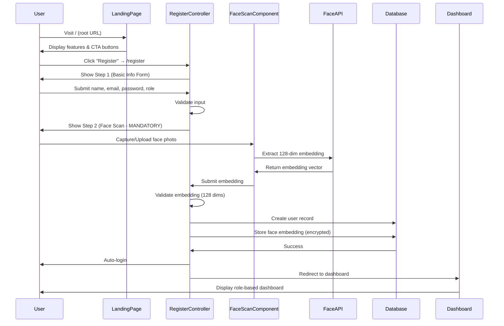

# Design Document: Landing Page & Face Scan Registration

## Overview

This feature transforms the Fotlist photography event platform's entry flow by introducing a professional landing page at the root URL and implementing mandatory face scan during customer registration. The landing page showcases platform features and benefits, while the enhanced registration flow captures user face embeddings for future quick photo searches. This design leverages the existing face-api.js infrastructure and integrates seamlessly with Laravel's authentication system.

## Main Algorithm/Workflow



## Core Interfaces/Types

### Backend (PHP/Laravel)

```php
// Request DTO for multi-step registration
interface RegistrationStepOneRequest {
    name: string;           // max 255 chars
    email: string;          // valid email, unique
    password: string;       // min 8 chars, confirmed
    role: 'customer' | 'photographer';
}

interface RegistrationStepTwoRequest {
    session_token: string;  // Temporary session identifier
    face_embedding: array;  // 128-dimensional float array
}

// User Model Extension
interface User {
    id: int;
    name: string;
    email: string;
    password: string;       // hashed
    role: 'admin' | 'photographer' | 'customer';
    wallet_balance: decimal;
    face_embedding_id: ?int; // Foreign key to user_face_embeddings
    created_at: timestamp;
    updated_at: timestamp;
}

// New Model: UserFaceEmbedding
interface UserFaceEmbedding {
    id: int;
    user_id: int;           // Foreign key to users
    embedding_vector: string; // JSON-encoded 128-dim array (encrypted)
    created_at: timestamp;
    updated_at: timestamp;
}
```

### Frontend (JavaScript)

```javascript
// Registration state management
interface RegistrationState {
    step: 1 | 2;
    formData: {
        name: string;
        email: string;
        password: string;
        password_confirmation: string;
        role: 'customer' | 'photographer';
    };
    faceEmbedding: Float32Array | null;
    sessionToken: string | null;
}

// Face scan component props
interface FaceScanRegistrationProps {
    onEmbeddingCaptured: (embedding: Float32Array) => void;
    onError: (error: string) => void;
    mandatory: boolean;     // Always true for registration
}
```

## Key Functions with Formal Specifications

### Backend Functions

#### Function 1: storeStepOne()

```php
function storeStepOne(Request $request): JsonResponse
```

**Preconditions:**
- `$request` contains validated name, email, password, password_confirmation, role
- Email is unique in database
- Password meets minimum requirements (8+ chars)
- Role is either 'customer' or 'photographer'

**Postconditions:**
- Returns JSON response with `session_token` and `success: true`
- Session data stored in cache/session with 15-minute expiration
- No user record created yet (deferred to step 2)
- If validation fails: returns 422 with error messages

**Loop Invariants:** N/A (no loops)

---

#### Function 2: storeStepTwo()

```php
function storeStepTwo(Request $request): RedirectResponse
```

**Preconditions:**
- `$request` contains valid `session_token` from step 1
- `$request` contains `face_embedding` array with exactly 128 numeric values
- Session data exists and has not expired
- All values in `face_embedding` are valid floats

**Postconditions:**
- User record created in `users` table
- Face embedding stored in `user_face_embeddings` table (encrypted)
- User is authenticated (logged in)
- Session token is invalidated/deleted
- Returns redirect to dashboard
- If validation fails: returns 422 with error messages
- If session expired: returns 419 with "Session expired" message

**Loop Invariants:** N/A (no loops)

---

#### Function 3: encryptEmbedding()

```php
function encryptEmbedding(array $embedding): string
```

**Preconditions:**
- `$embedding` is array of exactly 128 numeric values
- All values are valid floats

**Postconditions:**
- Returns encrypted string representation of embedding
- Encryption uses Laravel's `Crypt::encryptString()`
- Original embedding can be decrypted for future searches
- No mutations to input parameter

**Loop Invariants:** N/A (no loops)

---

### Frontend Functions

#### Function 4: initializeRegistrationFaceScan()

```javascript
async function initializeRegistrationFaceScan(
    onSuccess: (embedding: Float32Array) => void,
    onError: (message: string) => void
): void
```

**Preconditions:**
- face-api.js models are loaded
- DOM elements for camera/upload are present
- User is on registration step 2

**Postconditions:**
- Camera or file upload UI is initialized
- Event listeners attached for capture/upload
- On successful face detection: calls `onSuccess` with 128-dim embedding
- On error: calls `onError` with user-friendly message
- No embedding stored in localStorage/sessionStorage (privacy requirement)

**Loop Invariants:** N/A (event-driven)

---

#### Function 5: submitRegistrationStepTwo()

```javascript
async function submitRegistrationStepTwo(
    sessionToken: string,
    faceEmbedding: Float32Array
): Promise<void>
```

**Preconditions:**
- `sessionToken` is non-empty string from step 1
- `faceEmbedding` is Float32Array with exactly 128 elements
- CSRF token is available in DOM

**Postconditions:**
- POST request sent to `/register/step-two` with embedding and token
- On success (200): user is redirected to dashboard
- On validation error (422): error messages displayed to user
- On session expired (419): user redirected back to step 1 with message
- No side effects on input parameters

**Loop Invariants:** N/A (single async operation)

---

## Algorithmic Pseudocode

### Main Registration Workflow Algorithm

```pascal
ALGORITHM completeRegistration(userData, facePhoto)
INPUT: userData (name, email, password, role), facePhoto (image data)
OUTPUT: authenticatedUser or error

BEGIN
  // Step 1: Validate and store basic information
  ASSERT validateEmail(userData.email) = true
  ASSERT validatePassword(userData.password) = true
  ASSERT userData.role IN ['customer', 'photographer']
  
  sessionToken ← generateSecureToken(32)
  sessionData ← {
    name: userData.name,
    email: userData.email,
    password: hashPassword(userData.password),
    role: userData.role,
    expires_at: now() + 15 minutes
  }
  
  storeInSession(sessionToken, sessionData)
  
  // Step 2: Extract and validate face embedding
  faceEmbedding ← extractFaceEmbedding(facePhoto)
  
  IF faceEmbedding = NULL THEN
    RETURN Error("No face detected. Please try again with a clearer photo.")
  END IF
  
  ASSERT length(faceEmbedding) = 128
  ASSERT allElementsAreNumeric(faceEmbedding) = true
  
  // Step 3: Create user and store embedding
  BEGIN TRANSACTION
    user ← createUser(sessionData)
    encryptedEmbedding ← encryptEmbedding(faceEmbedding)
    userFaceEmbedding ← createUserFaceEmbedding(user.id, encryptedEmbedding)
    
    user.face_embedding_id ← userFaceEmbedding.id
    saveUser(user)
  COMMIT TRANSACTION
  
  // Step 4: Authenticate and redirect
  authenticateUser(user)
  deleteSession(sessionToken)
  
  RETURN user
END
```

**Preconditions:**
- userData contains all required fields
- facePhoto is valid image data
- Database connection is available

**Postconditions:**
- User record created with face embedding
- User is authenticated
- Session token is invalidated
- Returns authenticated user object

**Loop Invariants:** N/A (sequential steps)

---

### Face Embedding Extraction Algorithm

```pascal
ALGORITHM extractFaceEmbedding(imageElement)
INPUT: imageElement (HTMLImageElement or HTMLCanvasElement)
OUTPUT: embedding (128-dimensional array) or NULL

BEGIN
  ASSERT modelsLoaded = true
  ASSERT imageElement IS NOT NULL
  
  // Detect single face with landmarks and descriptor
  detection ← faceapi.detectSingleFace(imageElement)
                     .withFaceLandmarks()
                     .withFaceDescriptor()
  
  IF detection = NULL THEN
    displayError("No face detected. Please ensure your face is clearly visible.")
    RETURN NULL
  END IF
  
  // Extract descriptor (Float32Array)
  descriptor ← detection.descriptor
  
  // Convert to regular array
  embedding ← Array.from(descriptor)
  
  // Validate dimensions
  IF length(embedding) ≠ 128 THEN
    logError("Invalid embedding dimension: " + length(embedding))
    RETURN NULL
  END IF
  
  RETURN embedding
END
```

**Preconditions:**
- face-api.js models are loaded
- imageElement contains valid image data

**Postconditions:**
- Returns 128-dimensional embedding array if face detected
- Returns NULL if no face detected or invalid embedding
- No side effects on input parameter

**Loop Invariants:** N/A (single detection operation)

---

### Session Token Validation Algorithm

```pascal
ALGORITHM validateSessionToken(token)
INPUT: token (string)
OUTPUT: sessionData or NULL

BEGIN
  ASSERT token IS NOT NULL
  ASSERT length(token) > 0
  
  sessionData ← retrieveFromSession(token)
  
  IF sessionData = NULL THEN
    RETURN NULL
  END IF
  
  currentTime ← now()
  
  IF currentTime > sessionData.expires_at THEN
    deleteSession(token)
    RETURN NULL
  END IF
  
  RETURN sessionData
END
```

**Preconditions:**
- token is non-empty string

**Postconditions:**
- Returns session data if token is valid and not expired
- Returns NULL if token is invalid or expired
- Expired sessions are automatically deleted

**Loop Invariants:** N/A (single lookup operation)

---

## Example Usage

### Backend Controller Example

```php
// Step 1: Store basic information
public function storeStepOne(Request $request): JsonResponse
{
    $validated = $request->validate([
        'name' => 'required|string|max:255',
        'email' => 'required|email|unique:users,email',
        'password' => 'required|confirmed|min:8',
        'role' => 'required|in:customer,photographer',
    ]);
    
    $sessionToken = Str::random(32);
    
    Cache::put("registration:$sessionToken", [
        'name' => $validated['name'],
        'email' => $validated['email'],
        'password' => Hash::make($validated['password']),
        'role' => $validated['role'],
        'expires_at' => now()->addMinutes(15),
    ], 900); // 15 minutes
    
    return response()->json([
        'success' => true,
        'session_token' => $sessionToken,
        'message' => 'Please complete face scan to finish registration',
    ]);
}

// Step 2: Complete registration with face scan
public function storeStepTwo(Request $request): RedirectResponse
{
    $validated = $request->validate([
        'session_token' => 'required|string',
        'face_embedding' => 'required|array|size:128',
        'face_embedding.*' => 'numeric',
    ]);
    
    $sessionData = Cache::get("registration:{$validated['session_token']}");
    
    if (!$sessionData || now()->gt($sessionData['expires_at'])) {
        return back()->withErrors(['session' => 'Session expired. Please start registration again.']);
    }
    
    DB::transaction(function () use ($sessionData, $validated) {
        $user = User::create([
            'name' => $sessionData['name'],
            'email' => $sessionData['email'],
            'password' => $sessionData['password'],
            'role' => $sessionData['role'],
        ]);
        
        $encryptedEmbedding = Crypt::encryptString(json_encode($validated['face_embedding']));
        
        $userFaceEmbedding = UserFaceEmbedding::create([
            'user_id' => $user->id,
            'embedding_vector' => $encryptedEmbedding,
        ]);
        
        $user->update(['face_embedding_id' => $userFaceEmbedding->id]);
        
        Auth::login($user);
    });
    
    Cache::forget("registration:{$validated['session_token']}");
    
    return redirect()->route('dashboard');
}
```

### Frontend JavaScript Example

```javascript
// Registration state management
let registrationState = {
    step: 1,
    formData: null,
    faceEmbedding: null,
    sessionToken: null
};

// Step 1: Submit basic information
async function submitStepOne(formData) {
    const response = await fetch('/register/step-one', {
        method: 'POST',
        headers: {
            'Content-Type': 'application/json',
            'X-CSRF-TOKEN': document.querySelector('meta[name="csrf-token"]').content
        },
        body: JSON.stringify(formData)
    });
    
    if (!response.ok) {
        const errors = await response.json();
        displayValidationErrors(errors);
        return;
    }
    
    const data = await response.json();
    registrationState.sessionToken = data.session_token;
    registrationState.formData = formData;
    registrationState.step = 2;
    
    showStepTwo();
}

// Step 2: Capture face and complete registration
async function initializeStepTwo() {
    await loadModels(); // Load face-api.js models
    
    const uploadInput = document.getElementById('faceScanUpload');
    const captureBtn = document.getElementById('faceScanCapture');
    const submitBtn = document.getElementById('completeRegistration');
    
    submitBtn.disabled = true; // Disabled until face captured
    
    // Handle file upload
    uploadInput.addEventListener('change', async (event) => {
        const file = event.target.files[0];
        if (!file) return;
        
        const img = await loadImage(file);
        const embedding = await extractFaceEmbedding(img);
        
        if (embedding) {
            registrationState.faceEmbedding = embedding;
            submitBtn.disabled = false;
            showSuccessMessage('Face captured successfully!');
        }
    });
    
    // Handle camera capture
    captureBtn.addEventListener('click', async () => {
        const stream = await navigator.mediaDevices.getUserMedia({ video: true });
        const video = document.getElementById('video');
        video.srcObject = stream;
        
        setTimeout(async () => {
            const canvas = document.getElementById('canvas');
            const ctx = canvas.getContext('2d');
            ctx.drawImage(video, 0, 0, 320, 240);
            
            stream.getTracks().forEach(track => track.stop());
            
            const embedding = await extractFaceEmbedding(canvas);
            
            if (embedding) {
                registrationState.faceEmbedding = embedding;
                submitBtn.disabled = false;
                showSuccessMessage('Face captured successfully!');
            }
        }, 3000);
    });
    
    // Submit complete registration
    submitBtn.addEventListener('click', async () => {
        if (!registrationState.faceEmbedding) {
            alert('Please capture your face first');
            return;
        }
        
        const response = await fetch('/register/step-two', {
            method: 'POST',
            headers: {
                'Content-Type': 'application/json',
                'X-CSRF-TOKEN': document.querySelector('meta[name="csrf-token"]').content
            },
            body: JSON.stringify({
                session_token: registrationState.sessionToken,
                face_embedding: Array.from(registrationState.faceEmbedding)
            })
        });
        
        if (response.ok) {
            window.location.href = '/dashboard';
        } else if (response.status === 419) {
            alert('Session expired. Please start registration again.');
            window.location.href = '/register';
        } else {
            const errors = await response.json();
            displayValidationErrors(errors);
        }
    });
}
```

## Correctness Properties

### Universal Quantification Statements

1. **Registration Completeness**: ∀ user ∈ RegisteredUsers, user.face_embedding_id ≠ NULL ∧ user.role = 'customer' ⟹ ∃ embedding ∈ UserFaceEmbeddings, embedding.user_id = user.id ∧ length(decrypt(embedding.embedding_vector)) = 128

2. **Session Token Uniqueness**: ∀ token₁, token₂ ∈ ActiveSessionTokens, token₁ ≠ token₂ ⟹ sessionData(token₁) ≠ sessionData(token₂)

3. **Face Embedding Dimensionality**: ∀ embedding ∈ UserFaceEmbeddings, length(decrypt(embedding.embedding_vector)) = 128

4. **Registration Step Order**: ∀ registration ∈ RegistrationAttempts, completed(registration) = true ⟹ completed(step1(registration)) = true ∧ completed(step2(registration)) = true

5. **Privacy Preservation**: ∀ embedding ∈ ClientFaceEmbeddings, ¬∃ storage ∈ PersistentStorage, contains(storage, embedding) (client embeddings never persisted)

6. **Session Expiration**: ∀ token ∈ SessionTokens, now() > expiresAt(token) ⟹ valid(token) = false

7. **Role-Based Registration**: ∀ user ∈ RegisteredUsers, user.role = 'customer' ⟹ user.face_embedding_id ≠ NULL (only customers require face scan)

8. **Encryption Integrity**: ∀ embedding ∈ UserFaceEmbeddings, decrypt(encrypt(embedding.embedding_vector)) = embedding.embedding_vector

## Error Handling

### Error Scenario 1: No Face Detected

**Condition**: Face-api.js cannot detect a face in uploaded/captured image
**Response**: Display user-friendly error message: "Wajah tidak terdeteksi. Coba lagi dengan foto yang lebih jelas."
**Recovery**: Allow user to retry capture/upload without losing step 1 data

### Error Scenario 2: Session Token Expired

**Condition**: User takes longer than 15 minutes between step 1 and step 2
**Response**: Return 419 status with message: "Session expired. Please start registration again."
**Recovery**: Redirect user back to step 1 (registration form)

### Error Scenario 3: Invalid Embedding Dimensions

**Condition**: Extracted embedding does not have exactly 128 dimensions
**Response**: Log error to console, display generic error to user
**Recovery**: Allow user to retry face capture

### Error Scenario 4: Database Transaction Failure

**Condition**: User creation or embedding storage fails during transaction
**Response**: Rollback transaction, return 500 error
**Recovery**: Display error message, allow user to retry step 2 without re-entering step 1 data

### Error Scenario 5: Camera Access Denied

**Condition**: User denies camera permission or camera not available
**Response**: Display message: "Akses kamera ditolak. Silakan upload foto sebagai gantinya."
**Recovery**: Automatically show file upload option as alternative

### Error Scenario 6: Duplicate Email

**Condition**: Email already exists in database during step 1
**Response**: Return 422 validation error with message: "Email sudah terdaftar."
**Recovery**: Display error below email field, allow user to correct

## Testing Strategy

### Unit Testing Approach

**Backend Unit Tests (PHPUnit)**:
- Test `storeStepOne()` with valid and invalid inputs
- Test `storeStepTwo()` with valid session token and embedding
- Test `storeStepTwo()` with expired session token (expect failure)
- Test `encryptEmbedding()` and `decryptEmbedding()` round-trip
- Test session token generation uniqueness
- Test validation rules for all input fields

**Frontend Unit Tests (Jest)**:
- Test `extractFaceEmbedding()` with mock face-api.js
- Test `submitStepOne()` with valid form data
- Test `submitStepTwo()` with valid embedding
- Test error handling for no face detected
- Test session token storage and retrieval
- Test UI state transitions between steps

### Property-Based Testing Approach

**Property Test Library**: fast-check (JavaScript), Pest (PHP)

**Property 1: Embedding Dimensionality Invariant**
```javascript
// For all valid face images, extracted embedding has exactly 128 dimensions
fc.assert(
  fc.property(fc.validFaceImage(), async (image) => {
    const embedding = await extractFaceEmbedding(image);
    return embedding === null || embedding.length === 128;
  })
);
```

**Property 2: Session Token Uniqueness**
```php
// For all generated session tokens, no two tokens are identical
test('session tokens are always unique', function () {
    $tokens = collect(range(1, 1000))->map(fn() => Str::random(32));
    expect($tokens->unique()->count())->toBe(1000);
});
```

**Property 3: Encryption Round-Trip**
```php
// For all embeddings, encrypt then decrypt returns original value
test('embedding encryption is reversible', function () {
    $embedding = array_fill(0, 128, fake()->randomFloat(6, -1, 1));
    $encrypted = Crypt::encryptString(json_encode($embedding));
    $decrypted = json_decode(Crypt::decryptString($encrypted), true);
    expect($decrypted)->toBe($embedding);
});
```

**Property 4: Registration Completeness**
```php
// For all completed registrations, user has face embedding
test('all registered customers have face embeddings', function () {
    $user = User::factory()->create(['role' => 'customer']);
    $embedding = UserFaceEmbedding::factory()->create(['user_id' => $user->id]);
    $user->update(['face_embedding_id' => $embedding->id]);
    
    expect($user->fresh()->face_embedding_id)->not->toBeNull();
    expect($user->faceEmbedding)->toBeInstanceOf(UserFaceEmbedding::class);
});
```

### Integration Testing Approach

**End-to-End Registration Flow Test**:
1. Visit landing page at `/`
2. Click "Register" button
3. Fill step 1 form with valid data
4. Submit step 1 and verify session token received
5. Upload face photo in step 2
6. Verify face embedding extracted (128 dimensions)
7. Submit step 2
8. Verify user created in database
9. Verify face embedding stored and encrypted
10. Verify user is authenticated
11. Verify redirect to dashboard

**API Integration Tests**:
- Test `/register/step-one` endpoint with valid/invalid data
- Test `/register/step-two` endpoint with valid session token
- Test `/register/step-two` endpoint with expired session token
- Test `/register/step-two` endpoint with invalid embedding dimensions

## Performance Considerations

**Face Embedding Extraction**:
- Face-api.js processing takes 1-3 seconds on average
- Display loading indicator during extraction
- Use Web Workers for face detection to avoid blocking UI

**Session Storage**:
- Use Laravel Cache (Redis recommended) for session tokens
- Set 15-minute TTL to automatically clean up expired sessions
- Index session tokens for fast lookup

**Database Optimization**:
- Index `users.email` for unique constraint checks
- Index `user_face_embeddings.user_id` for relationship queries
- Use database transactions to ensure atomicity

**Landing Page Performance**:
- Lazy load images and animations
- Minimize initial bundle size
- Use CDN for static assets

## Security Considerations

**Face Embedding Privacy**:
- Encrypt all face embeddings at rest using Laravel's `Crypt` facade
- Never log or expose raw embeddings in API responses
- Client embeddings never stored (in-memory only during registration)

**Session Token Security**:
- Generate cryptographically secure random tokens (32 bytes)
- Store tokens in secure cache (Redis with authentication)
- Implement 15-minute expiration to limit attack window
- Invalidate token immediately after successful registration

**Input Validation**:
- Validate all inputs on both client and server side
- Sanitize user inputs to prevent XSS attacks
- Use Laravel's validation rules for type safety
- Verify embedding dimensions (exactly 128) before storage

**CSRF Protection**:
- Include CSRF token in all POST requests
- Verify CSRF token on server side
- Use Laravel's built-in CSRF middleware

**Rate Limiting**:
- Limit registration attempts per IP (e.g., 5 per hour)
- Prevent brute force attacks on session tokens
- Use Laravel's throttle middleware

## Dependencies

**Backend (PHP/Laravel)**:
- Laravel 11.x framework
- Laravel Cache (Redis recommended)
- Laravel Crypt facade for encryption
- PHPUnit for testing

**Frontend (JavaScript)**:
- face-api.js (v0.22.2 or later) - face detection and embedding extraction
- TensorFlow.js (dependency of face-api.js)
- Tailwind CSS for styling
- Jest for testing
- fast-check for property-based testing

**Infrastructure**:
- Redis for session storage (recommended)
- MySQL/PostgreSQL for user and embedding storage
- HTTPS for secure transmission of face embeddings

**External Services**:
- None (all processing done client-side and server-side)
